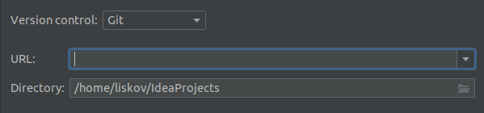
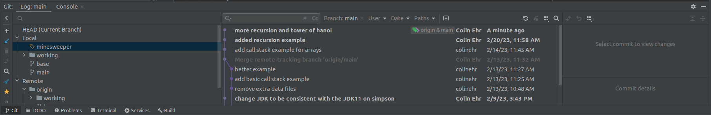
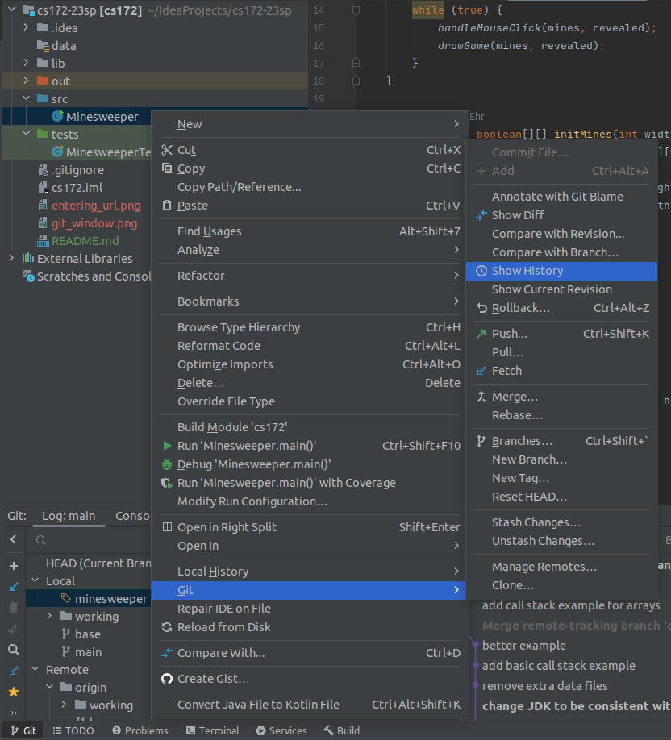
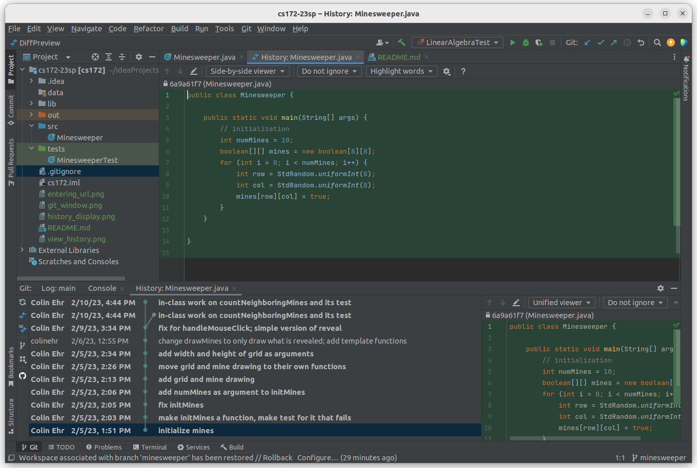
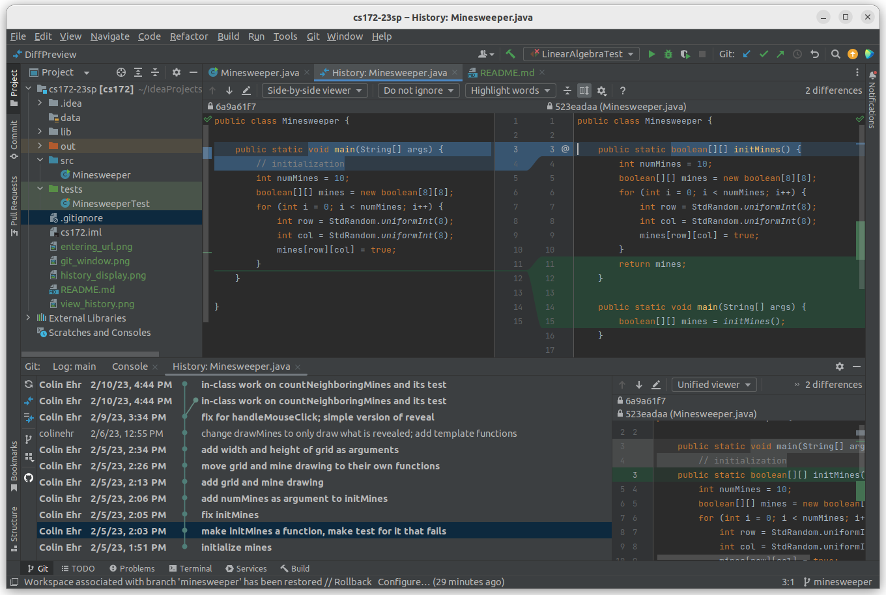

# CS172-02 Code Examples

This repository contains code examples for my Computer Science II class, Spring 2023.
(A *repository* is a source of code.)

## Downloading the Examples

In IntelliJ, go to *File -> New -> Project From Version Control...* and in the
URL field enter

~~~
https://github.com/colinehr/cs172-23sp.git
~~~

and hit the *Clone* button.

This will create the `cs172-23sp` folder and prompt you to open it in IntelliJ.

## Reading the Examples

When you download this project, it downloads not just the code examples but a
history of each file you can follow, as well as multiple *branches* of the project
that contain different examples. By default, it will open the `main` branch, which
contains smaller examples and finished versions of larger examples.

To view a larger in-progress example, go to the *Git* tab on the bottom-left of
the IntelliJ window. This will open a sub-window with the branches on the left,
and the edit history on the right. To open a branch, right-click the name of the
branch and hit *Checkout*. For example, to see the Minesweeper example,
right-click `minesweeper` and hit *Checkout*. This will show the full history of
the minesweeper example and will change the files in the project to the minesweeper
code.

## Viewing the History of a File

Reading a complete, finished, and polished example can be helpful, but it can also
be overwhelming. A program is rarely written top to bottom and without any
additional changes, and reading a finished example doesn't give any insight into
the process of writing it. Fortunately, you can walk through each iteration of an
example and see how it changes throughout the coding process.

To see a file's full history, right-click the file in the navigation bar on the
left side, then go to *Git -> Show History*.

This will show a bottom bar where each line represents a version of the file, and
the versions are in chronological order with the newest first and the oldest last.
If you double-click the last row, it will open a window with that version of the
code.

The code is highlighted green because it's new to the project, since it's the first
version of the `Minesweper.java` file. If you open the second version of the file,
it will show you not only that version of the code (on the right), but also the
previous version (on the left), as well as a visual cue for what has changed between
versions, so that you can compare and contrast.

Because we spun out most of the code in the `main` function into a function called
`initMines`, the function line is displayed in blue to show that it changes between
functions.

To understand an example, I recommend walking through each version of the file from
oldest to newest and understanding each change that was made and the result of that
change.

## Updating the Code Examples

As there are more in-class examples, they will be added to this repository. To get
new changes, go to the top menu and click *Git -> Fetch*. This will not change
anything right away, but will add new versions of files to the bottom Git dialog.